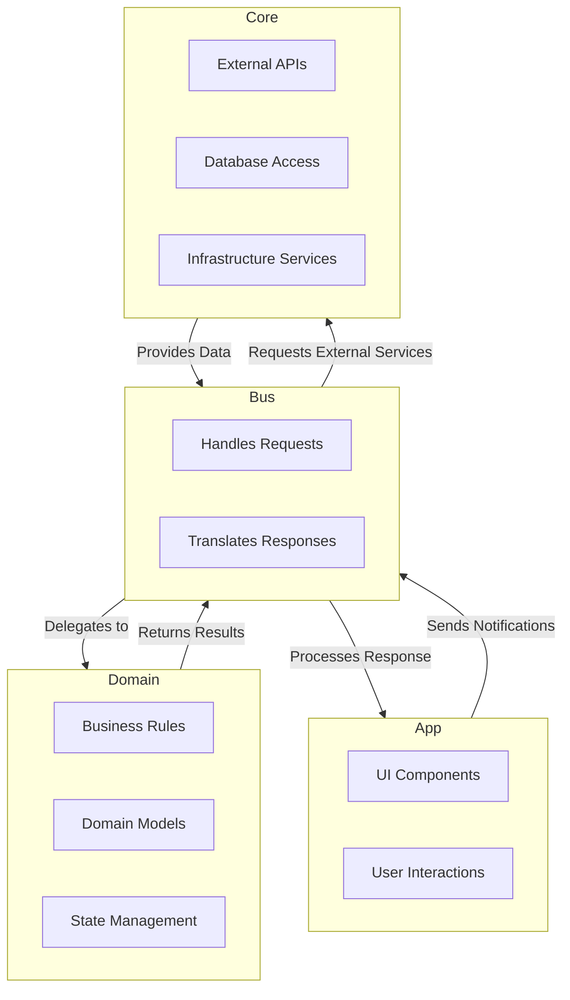

# ABCD Architecture (App-Bus-Core-Domain)

This repository provides a detailed guide and example program to understand and implement the **ABCD (App-Bus-Core-Domain)** architecture. It is designed to demonstrate how to structure applications with clear responsibilities, leveraging a modular and scalable approach.

---

## **Table of Contents**
- [What is ABCD Architecture?](#what-is-abcd-architecture)
- [Key Features](#key-features)
- [Components](#components)
- [Execution Flow](#execution-flow)
- [Advantages](#advantages)
- [Example Use Case](#example-use-case)
- [Contributing](#contributing)
- [License](#license)

---

## **What is ABCD Architecture?**

The ABCD architecture is a layered design pattern that aims to:
- Isolate the business logic (`Domain`) from infrastructure and user interface concerns.
- Introduce a `Bus` as a mediator that handles communication between the `App`, `Domain`, and `Core`.
- Promote reusability and scalability by separating responsibilities into distinct components.

This architecture is particularly useful in systems with complex business logic or multi-platform applications.

---

## **Key Features**

1. **Business Logic Isolation**:
   - The `Domain` layer contains all the core business logic and remains independent of infrastructure and UI.

2. **Mediator Layer**:
   - The `Bus` ensures loose coupling between components and translates requests and responses.

3. **Infrastructure Layer**:
   - The `Core` provides essential services like database access, API integrations, and external dependencies.

4. **UI Layer**:
   - The `App` focuses exclusively on user interaction and presentation.

5. **Scalability**:
   - The architecture allows for modular extensions and can evolve without affecting unrelated layers.

---

## **Components**

### 1. **App**
   - **Responsibilities**:
     - Handle user interactions and present data.
   - **Dependencies**:
     - Only communicates with the `Bus`.
   - **Example Tasks**:
     - Rendering lists, forms, and responding to user inputs.

### 2. **Bus**
   - **Responsibilities**:
     - Act as a mediator between the `App`, `Domain`, and `Core`.
     - Translate high-level requests into actionable tasks for other components.
   - **Dependencies**:
     - Knows about the `Domain` and the `Core`.

### 3. **Domain**
   - **Responsibilities**:
     - Encapsulate all business rules and logic.
   - **Dependencies**:
     - None. Delegates external concerns to the `Bus`.

### 4. **Core**
   - **Responsibilities**:
     - Provide infrastructure services like APIs, databases, or file storage.
   - **Dependencies**:
     - May depend on external libraries or services.

---

## **Execution Flow**

1. The user interacts with the `App` (e.g., clicks a button).
2. The `App` notifies the `Bus` of the user's action.
3. The `Bus` processes the request and delegates it to the `Domain` or `Core`, depending on the task.
4. The `Domain` may return:
   - Instructions for the `App` (e.g., display a message).
   - Requests for external data handled by the `Core`.
5. The `Bus` translates the response and sends it back to the `App`.

---

## **Advantages**

- **Modularity**:
  - Each layer has clear responsibilities and can be tested independently.

- **Maintainability**:
  - Changes in one layer have minimal impact on others.

- **Reusability**:
  - The `Domain` and `Core` can be reused across different platforms (web, mobile, CLI).

- **Scalability**:
  - New features can be added without disrupting the existing architecture.

---

## **Example Use Case**

### Showing a List of Products
1. The user opens the application and selects "View Products".
2. The `App` notifies the `Bus` about the action (`UserWantsToSeeProducts`).
3. The `Bus` forwards the request to the `Domain`.
4. The `Domain` determines that product data is needed and requests it from the `Core`.
5. The `Core` retrieves the data (e.g., from a database or API) and sends it back to the `Domain`.
6. The `Domain` provides instructions to the `Bus` on how to present the data to the user.
7. The `Bus` formats the response and sends it to the `App` for rendering.

---

## **License**

This project is licensed under the MIT License. See the `LICENSE` file for details.
